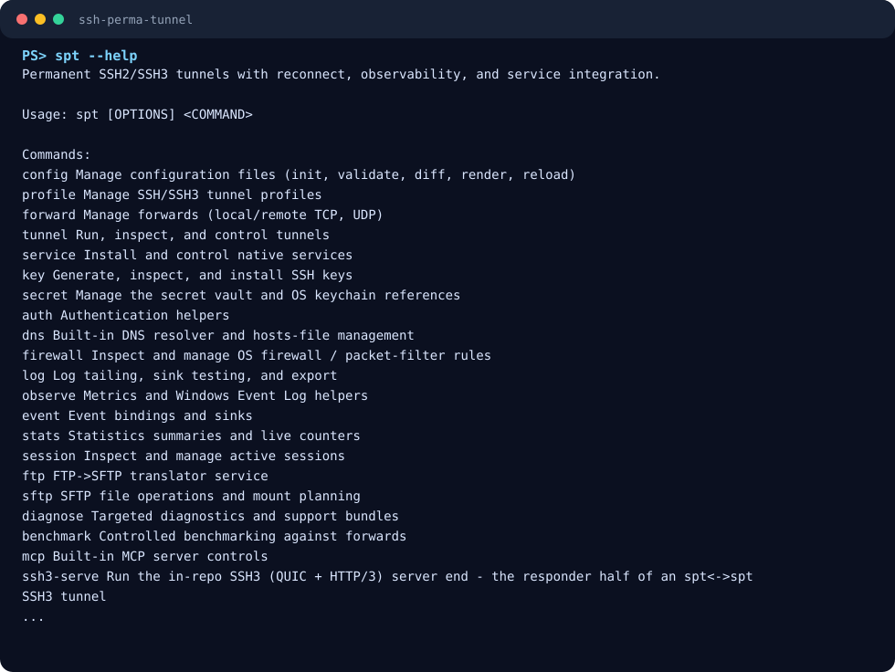

# ssh-perma-tunnel (`spt`)

[](https://github.com/supermarsx/ssh-perma-tunnel/actions/workflows/ci.yml)
[](license.md)
[](rust-toolchain.toml)
[](https://github.com/supermarsx/ssh-perma-tunnel/releases)

`spt` is a single command-line tool for running permanent SSH tunnels. It keeps
local, reverse, dynamic, TCP, UDP, and UNIX-socket forwards alive across network
drops, DNS changes, host restarts, service restarts, and normal operational
drift.

It is client-side tunnel infrastructure. Bring an existing SSH2 or SSH3 server;
`spt` connects to it, supervises the forwards, reports status, and integrates
with the host service manager.



## Table of Contents

- [What spt is for](#what-spt-is-for)
- [Install](#install)
- [60-second quick start](#60-second-quick-start)
- [Common workflows](#common-workflows)
- [Configuration basics](#configuration-basics)
- [Command map](#command-map)
- [Operations and security](#operations-and-security)
- [Documentation](#documentation)
- [Development](#development)
- [License](#license)

## What spt is for

Use `spt` when a normal `ssh -L`, `ssh -R`, or SOCKS command is not enough.

| Need | Use `spt` for |
|------|---------------|
| Keep a tunnel up for days or months | Reconnect, backoff, health checks, and daemon/service integration. |
| Run several forwards as one unit | Named profiles with local, remote, dynamic, TCP, UDP, and UNIX-socket forwards. |
| Operate on workstations and servers | Linux systemd, macOS launchd, Windows SCM, OpenRC, SysV, and Task Scheduler support. |
| Avoid plaintext secrets in configs | Secret references, OS keychains, encrypted vaults, and redacted diagnostics. |
| Observe what is happening | Status snapshots, JSON output, logs, events, Prometheus, OTLP, SNMPv3, and support bundles. |

`spt` is not an SSH server replacement. It can speak to existing SSH2 servers
and an experimental SSH3/RTH3 server, but its normal role is to run on the
client side.

## Install

### Release packages

Download the latest release from
[GitHub Releases](https://github.com/supermarsx/ssh-perma-tunnel/releases).

| Platform | Artifact |
|----------|----------|
| Linux | `.deb`, `.rpm`, and tarball artifacts |
| macOS | `.pkg` |
| Windows | `.msi` and `.zip` |
| Docker | `ghcr.io/supermarsx/spt:<version>` |

Package-specific verification and install notes live in
[docs/installation.md](docs/installation.md).

### From source

Requires Rust 1.88 or newer, pinned by [rust-toolchain.toml](rust-toolchain.toml).

```sh
cargo build --release -p spt-bin
sudo install -m 0755 target/release/spt /usr/local/bin/spt
```

On Windows, use the generated binary at:

```powershell
.\target\release\spt.exe --help
```

## 60-second quick start

Start from the bundled minimal config, edit the SSH endpoint, validate it, and
run the tunnel in the foreground.

```sh
cp examples/minimal.toml spt.toml
$EDITOR spt.toml
spt config validate --config spt.toml
spt tunnel run --foreground --config spt.toml
```

In another shell, use the local end of the forward:

```sh
curl http://127.0.0.1:8080/
spt tunnel status --config spt.toml
```

A successful validation exits `0` and reports the number of loaded profiles.
Validation errors include field paths so you can jump straight to the bad
setting.

## Common workflows

| Goal | Command |
|------|---------|
| Validate a config | `spt config validate --config spt.toml` |
| Run in the foreground | `spt tunnel run --foreground --config spt.toml` |
| Show live tunnel status | `spt tunnel status --config spt.toml` |
| Install as a service | `spt service install --config /etc/spt/spt.toml --system` |
| Add a profile interactively | `spt profile configure --tui --name edge` |
| Add a local forward | `spt forward add local --profile edge --listen 127.0.0.1:5432 --to db:5432` |
| Test authentication | `spt auth test --profile edge --config spt.toml` |
| Create a support bundle | `spt diagnose bundle --config spt.toml` |
| Generate shell completions | `spt completion generate bash` |

Every command supports `--help`, and most mutating commands support `--dry-run`.

## Configuration basics

The smallest useful config is a profile plus one forward:

```toml
version = 1

[[profiles]]
name = "edge"
enabled = true
protocol = "ssh2"
host = "bastion.example.com"
port = 22
user = "alice"

[profiles.auth]
method = "agent"

[profiles.trust]
mode = "known_hosts"
strict = true

[[profiles.forwards]]
name = "web"
type = "local"
transport = "tcp"
bind = "127.0.0.1:8080"
target = "service.internal:80"
target_resolve = "remote"
required = true
```

See [examples/](examples/) for jump hosts, reverse forwards, SSH3, SMTP relays,
split-horizon DNS, observability, and service-mode examples.

## Command map

`spt` is organized as a Docker-style command tree. The full generated command
reference is in [docs/cli-reference.md](docs/cli-reference.md).

| Area | Commands |
|------|----------|
| Config and profiles | `config`, `profile`, `forward`, `tunnel` |
| Host integration | `service`, `dns`, `firewall`, `status`, `status-api` |
| Security | `key`, `secret`, `auth`, `trust`, `diagnose` |
| File and app protocols | `sftp`, `ftp`, `ssh3-serve` |
| Observability | `log`, `observe`, `event`, `stats`, `session`, `benchmark` |
| Automation | `mcp`, `completion`, `about`, `update`, `kill` |

Machine-readable output is available through `--output json`, `--output jsonl`,
`--output yaml`, or the `--json` shortcut.

## Operations and security

- **Client-only by default:** `spt` connects to your existing SSH endpoint and
  supervises the tunnel from the client host.
- **Strict trust options:** known-hosts validation is the normal path; relaxed
  trust modes are explicit.
- **Secret-safe configs:** configs can reference `secret://` values instead of
  embedding passwords, keys, or tokens.
- **Redacted diagnostics:** logs, events, MCP responses, and support bundles use
  the configured redaction policy.
- **Service-friendly runtime:** status files, single-supervisor locks, graceful
  reloads, health checks, and host service integration are built in.

Security details and the threat model live in [docs/security.md](docs/security.md).

## Documentation

Start here:

- [Getting Started](docs/getting-started.md)
- [Installation](docs/installation.md)
- [Configuration](docs/configuration.md)
- [CLI Reference](docs/cli-reference.md)
- [Profiles](docs/profiles.md)
- [Forwards](docs/forwards.md)
- [Authentication](docs/auth.md)
- [Trust](docs/trust.md)
- [Secrets](docs/secrets.md)
- [Service Integration](docs/service-integration.md)
- [Troubleshooting](docs/troubleshooting.md)

Deeper topics:

- [SFTP](docs/sftp.md)
- [Obfuscation](docs/obfuscation.md)
- [Scripting](docs/scripting.md)
- [DNS](docs/dns.md)
- [Firewall](docs/firewall.md)
- [Observability](docs/observability.md)
- [Events](docs/events.md)
- [Diagnostics](docs/diagnostics.md)
- [Benchmarking](docs/benchmarking.md)
- [MCP](docs/mcp.md)
- [TUI](docs/tui.md)
- [SSH3](docs/ssh3.md)
- [Remote Config](docs/remote-config.md)
- [Updater](docs/updater.md)
- [Versioning](docs/versioning.md)

The full product specification lives at [spec.md](spec.md).

## Development

Common local checks:

```sh
cargo fmt --all -- --check
cargo check --workspace --locked
cargo clippy --workspace --all-targets --locked -- -D warnings
```

Refresh the README screenshot from the live CLI help:

```sh
python scripts/docs/render-readme-screenshot.py
python scripts/docs/render-readme-screenshot.py --check
```

Clean generated Rust build output from every nested workspace:

```powershell
.\scripts\clean-targets.ps1 -DryRun
.\scripts\clean-targets.ps1
```

```sh
bash scripts/clean-targets.sh --dry-run
bash scripts/clean-targets.sh
```

The screenshot renderer uses `CARGO_TARGET_DIR` under the system temp directory
by default, so refreshing docs does not recreate a project-local `target/`.

## License

MIT. See [license.md](license.md).
